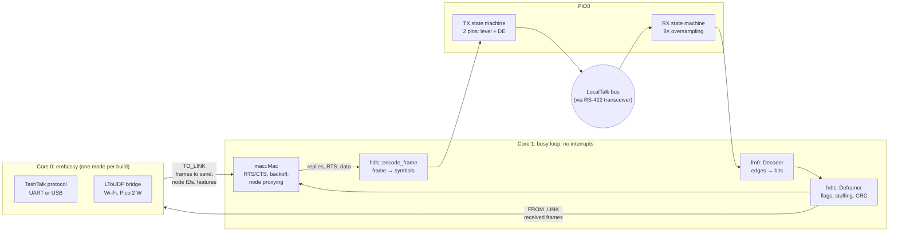

# picotalk

A LocalTalk interface for the RP2350 (Raspberry Pi Pico 2 / Pico 2 W), written
in Rust. It replaces the PIC12F1840 running
[TashTalk](https://github.com/lampmerchant/tashtalk): the RP2350's PIO does the
line coding, and its second core runs the LLAP link layer.

This project is inspired by, and closely follows, Tashtari's excellent
[TashTalk](https://github.com/lampmerchant/tashtalk), a complete LocalTalk
interface on a single 8-pin PIC. Its firmware and documentation were the
reference for the framing, timing, backoff behaviour and host protocol here.
All credit for working out how to do LocalTalk on a tiny microcontroller goes
to TashTalk.

Three modes, chosen at build time:

| Feature               | What it does                                                                 |
|-----------------------|------------------------------------------------------------------------------|
| `host-uart` (default) | TashTalk protocol on UART0: drop-in for a TashTalk chip (AirTalk, Pi hat, …) |
| `host-usb`            | TashTalk protocol over USB CDC-ACM: plug into a PC and run tashtalkd/TashRouter |
| `ltoudp`              | Pico 2 W only: standalone LocalTalk ⇄ LToUDP bridge over Wi-Fi, no host      |

> **Status:** compiles for all three modes and the protocol core is covered by
> host tests (loopback through the encoder and decoder at ±3 % clock skew), but it
> **has not been tried on hardware or against a real Mac yet.**

## Layout

```
llap/       no_std core, host-testable: CRC, FM0, HDLC framing, MAC,
            TashTalk protocol, LToUDP bridge policy
firmware/   RP2350 firmware (embassy): PIO programs, core-1 link loop,
            core-0 host/Wi-Fi side
```

### How it works



* **RX:** a one-instruction PIO program samples the line at 1.8432 MHz
  (8× 230.4 kbit/s) into 32-bit words. Software finds the edges and sorts the
  gaps between them into half-bit, full-bit and idle.
* **TX:** frames are pre-encoded into half-bit symbols (line level plus driver
  enable), and a one-instruction PIO program shifts them out. The sync pulse,
  preamble, flags, stuffing, abort sequence and driver release all come from
  the symbol stream, so the timing is exact.
* **MAC:** inter-dialog gap plus random backoff, RTS/CTS, broadcast silence
  wait, adaptive global and local backoff from collision/deferral history, and
  32 attempts. This follows TashTalk and *Inside AppleTalk*. It answers RTS and
  ENQ for every node ID in the node bitmap.
* **LToUDP mode:** AirTalk's forwarding rules. RTS/CTS stay local. Datagrams
  go onto LocalTalk only if they are broadcast or addressed to a node seen
  locally in the last hour. Nodes heard over UDP in the last 30 minutes are
  proxied (the link answers their RTS/ENQ).

## Wiring

You need an RS-422/485 transceiver that works at 3.3 V (see TashTalk's
[transceivers.md](https://github.com/lampmerchant/tashtalk/blob/main/documentation/transceivers.md))
and the usual LocalTalk/PhoneNet connection on its A/B side.

| Pico GPIO | Connect to                                         |
|-----------|----------------------------------------------------|
| GP6       | transceiver RO (receive out)                       |
| GP7       | transceiver DI (driver in)                         |
| GP8       | transceiver DE **and** /RE (tied together)         |
| GP0       | host RX (UART mode)                                |
| GP1       | host TX (UART mode)                                |
| GP3       | host CTS: low means the host may send (UART mode)  |
| GP2       | host RTS, optional; pulled low internally          |

The UART runs at 1 Mbaud 8N1, like TashTalk.

## Building

```sh
rustup target add thumbv8m.main-none-eabihf

# Host-side tests of the protocol core
cd llap && cargo test

# Firmware (UART mode)
cd firmware && cargo build --release
# USB mode
cargo build --release --no-default-features --features host-usb
# Standalone Wi-Fi LToUDP bridge (Pico 2 W)
WIFI_SSID=myssid WIFI_PASSWORD=secret \
  cargo build --release --no-default-features --features ltoudp

# Flash: `cargo run --release …` with a debug probe (probe-rs), or
# picotool load -u -v -x -t elf target/thumbv8m.main-none-eabihf/release/picotalk
```

## Known gaps / next steps

* Hardware bring-up: check the TX waveform and RX decode with a logic analyser,
  then against a real Mac, and check the RTS→CTS turnaround stays within the
  200 µs gap.
* Core 1 code runs from flash through the XIP cache. If cache misses cause
  jitter, move the hot path into RAM.
* The Wi-Fi credentials are fixed at build time. AirTalk-style configuration
  (NBP `AirTalkAP` scan and `airtalk setap` ATP from the Chooser extension, or
  a setup access point) is not implemented yet.
* There are no status LEDs yet.

## Credits and license

The link-layer behaviour (framing details, sync pulse, backoff algorithm,
host protocol) follows Tashtari's [TashTalk](https://github.com/lampmerchant/tashtalk).
The LToUDP forwarding rules follow Rob Mitchelmore's
[AirTalk](https://github.com/cheesestraws/airtalk). TashTalk is GPL-3.0, so this
project is licensed **GPL-3.0** too (see `LICENSE`).
`firmware/cyw43-firmware/` holds Infineon's CYW43439 blobs under their own
permissive binary license.
