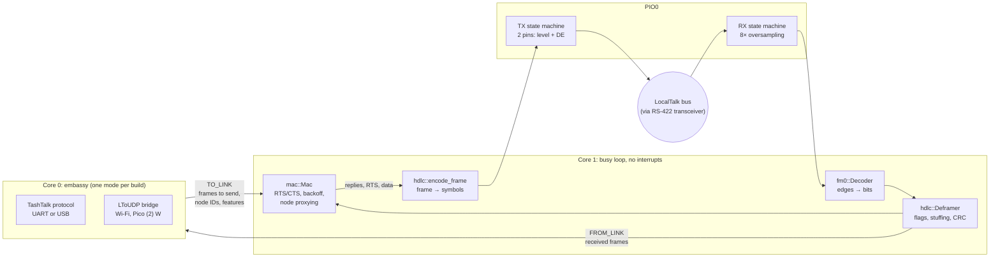
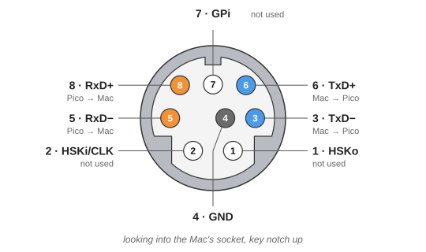

# picotalk

A LocalTalk interface for the RP2350 (Raspberry Pi Pico 2 / Pico 2 W) and the
RP2040 (Pico / Pico W), written in Rust. It replaces the PIC12F1840 running
[TashTalk](https://github.com/lampmerchant/tashtalk): the chip's PIO does the
line coding, and its second core runs the LLAP link layer.

This project is inspired by, and closely follows, Tashtari's excellent
[TashTalk](https://github.com/lampmerchant/tashtalk), a complete LocalTalk
interface on a single 8-pin PIC. Its firmware and documentation were the
reference for the framing, timing, backoff behaviour and host protocol here.
All credit for working out how to do LocalTalk on a tiny microcontroller goes
to TashTalk.

Three modes, chosen at build time:

| Feature               | What it does                                                                 |
|-----------------------|------------------------------------------------------------------------------|
| `host-uart` (default) | TashTalk protocol on UART0: drop-in for a TashTalk chip (AirTalk, Pi hat, …) |
| `host-usb`            | TashTalk protocol over USB CDC-ACM: plug into a PC and run tashtalkd/TashRouter |
| `ltoudp`              | Pico 2 W or Pico W: standalone LocalTalk ⇄ LToUDP bridge over Wi-Fi, no host |

> **Status:** compiles for all three modes and the protocol core is covered by
> host tests (loopback through the encoder and decoder at ±3 % clock skew), but it
> **has not been tried on hardware or against a real Mac yet.**

## Layout

```
llap/       no_std core, host-testable: CRC, FM0, HDLC framing, MAC,
            TashTalk protocol, LToUDP bridge policy
firmware/   RP2350 / RP2040 firmware (embassy): PIO programs, core-1 link loop,
            core-0 host/Wi-Fi side
```

### How it works



* **RX:** a one-instruction PIO program samples the line at 1.8432 MHz
  (8× 230.4 kbit/s) into 32-bit words. Software finds the edges and sorts the
  gaps between them into half-bit, full-bit and idle.
* **TX:** frames are pre-encoded into half-bit symbols (line level plus driver
  enable), and a one-instruction PIO program shifts them out. The sync pulse,
  preamble, flags, stuffing, abort sequence and driver release all come from
  the symbol stream, so the timing is exact.
* **MAC:** inter-dialog gap plus random backoff, RTS/CTS, broadcast silence
  wait, adaptive global and local backoff from collision/deferral history, and
  32 attempts. This follows TashTalk and *Inside AppleTalk*. It answers RTS and
  ENQ for every node ID in the node bitmap.
* **LToUDP mode:** AirTalk's forwarding rules. RTS/CTS stay local. Datagrams
  go onto LocalTalk only if they are broadcast or addressed to a node seen
  locally in the last hour. Nodes heard over UDP in the last 30 minutes are
  proxied (the link answers their RTS/ENQ).

## Wiring

### Pico pins

| Pico GPIO | Function                                            |
|-----------|-----------------------------------------------------|
| GP6       | LocalTalk RX: from transceiver receiver output      |
| GP7       | LocalTalk TX: to transceiver driver input           |
| GP8       | Driver enable: high while transmitting              |
| GP0       | UART TX → host RX (`host-uart` mode)                |
| GP1       | UART RX ← host TX (`host-uart` mode)                |
| GP3       | UART RTS → host CTS: low = host may send            |
| GP2       | UART CTS ← host RTS, optional (pulled low)          |

The UART runs at 1 Mbaud 8N1, like TashTalk. In `ltoudp` mode only GP6–GP8 are used.

### Choosing a transceiver

LocalTalk is RS-422-style differential signalling. Any transceiver you use must:

* run on **3.3 V** (the Pico's GPIOs are not 5 V tolerant);
* have a **fail-safe receiver**, which outputs a steady level when nobody drives
  the pair. The Mac tri-states its transmitter between frames. This is why not
  every RS-485 part works (see TashTalk's
  [transceivers.md](https://github.com/lampmerchant/tashtalk/blob/main/documentation/transceivers.md));
* be rated for **≥ 500 kbit/s**. LocalTalk runs at 230.4 kbit/s, so
  "250 kbit/s slew-limited" parts are too close.

### Option A: direct connection to one Mac (no LocalTalk box)

The Mac's mini-DIN-8 port has separate transmit and receive pairs. For a
single Mac you can wire them straight to the Pico with no transformer box, as
[AirTalk](https://github.com/cheesestraws/airtalk) does.



| Pin | Name     | Dir (Mac) | Description                       | picotalk            |
|-----|----------|-----------|-----------------------------------|---------------------|
| 1   | HSKo     | out       | Output handshake                  | not used            |
| 2   | HSKi/CLK | in        | Input handshake or external clock | not used            |
| 3   | TxD−     | out       | Transmit data (−)                 | Mac → Pico          |
| 4   | GND      | –         | Ground                            | connect to Pico GND |
| 5   | RxD−     | in        | Receive data (−)                  | Pico → Mac          |
| 6   | TxD+     | out       | Transmit data (+)                 | Mac → Pico          |
| 7   | GPi      | in        | General purpose input             | not used            |
| 8   | RxD+     | in        | Receive data (+)                  | Pico → Mac          |

Both ports (Printer and Modem) have this pinout, on every Mac from the Plus
onwards and on the Apple IIgs. The 128K and 512K use a DB-9 with a different
layout. Pinout per [allpinouts.org](https://allpinouts.org/pinouts/connectors/serial/apple-macintosh-rs-422-serial/).

These are the pins **on the Mac**. If you put a mini-DIN-8 socket on your
board, either wire it with these numbers and use a straight-through cable, or
wire it "like a Mac" (TxD↔RxD swapped) and use a Mac-to-printer crossover cable,
as AirTalk does.

#### A1 (recommended): one full-duplex TI THVD2442

A single chip covers both directions. It has built-in ±16 kV ESD and ±70 V
bus-fault protection, and idle-bus fail-safe, so no external protection parts
are needed. Use the 20 Mbit/s **THVD2442**, not the 250 kbit/s THVD2412. The
package is a 3 × 3 mm VSON-10; assembly services handle it easily, hand
soldering is harder.

| THVD2442 pin | Connect to                            |
|--------------|---------------------------------------|
| 1 R          | GP6                                   |
| 2 /RE        | GND (receiver always on)              |
| 3 DE         | GP8                                   |
| 4 D          | GP7                                   |
| 5 GND        | GND                                   |
| 6 Y          | Mac RxD+ (pin 8)                      |
| 7 Z          | Mac RxD− (pin 5)                      |
| 8 B          | Mac TxD− (pin 3)                      |
| 9 A          | Mac TxD+ (pin 6)                      |
| 10 VCC       | 3V3, 0.1–1 µF to GND                  |
| thermal pad  | GND                                   |

#### A2: two half-duplex transceivers (e.g. GM3085E, SOIC-8)

This is AirTalk's proven design: one chip only drives, the other only receives.

| Pin     | U1: driver (Pico → Mac)   | U2: receiver (Mac → Pico) |
|---------|---------------------------|---------------------------|
| RO      | not connected             | GP6                       |
| /RE     | 3V3 (receiver off)        | GND (receiver always on)  |
| DE      | GP8                       | GND (driver off)          |
| DI      | GP7                       | GND                       |
| A / B   | Mac RxD+ (8) / RxD− (5)   | Mac TxD+ (6) / TxD− (3)   |
| VCC     | 3V3, 1 µF to GND          | 3V3, 1 µF to GND          |

For protection, copy AirTalk's line filtering: 2 × 25 Ω in series on each
line, 200 pF to GND, and an SM712 TVS per pair. See sheet 3 of its schematic.

### Option B: on a LocalTalk network (several Macs, printers, IIgs, …)

To join an existing LocalTalk/PhoneNet network, connect through a LocalTalk
or PhoneNet box like any other node. Use the **same wiring as Option A**
(A1 or A2), with the box plugged in where the Mac would be. The box expects a
Mac on its plug, so the Pico simply behaves like one. Terminate the network at
both ends as usual.

Inside the box the transmit and receive pairs share one bus pair, so the Pico
hears its own transmissions. The firmware ignores the receiver while it is
transmitting, so that is expected.

### Bring-up tips

* **If the Mac never answers, swap the + and − wires of one pair.** Vendors
  disagree about which of A/B is "+". FM0 itself doesn't care about polarity,
  but the idle level does.
* A logic analyser on GP6/GP7/GP8 is the quickest way to see what's going on.
  The RTS → CTS turnaround must stay within 200 µs.

## Building

A build picks one chip (`rp2350`, the default, or `rp2040`) and one mode
(`host-uart`, the default, `host-usb` or `ltoudp`).

```sh
rustup target add thumbv8m.main-none-eabihf   # RP2350
rustup target add thumbv6m-none-eabi          # RP2040

# Host-side tests of the protocol core
cd llap && cargo test

# RP2350 (Pico 2 / Pico 2 W)
cd firmware && cargo build --release           # UART mode
cargo build --release --no-default-features --features rp2350,host-usb
WIFI_SSID=myssid WIFI_PASSWORD=secret \
  cargo build --release --no-default-features --features rp2350,ltoudp

# RP2040 (Pico / Pico W): the same modes, with the chip and target changed
cargo build --release --no-default-features --features rp2040,host-uart \
  --target thumbv6m-none-eabi
WIFI_SSID=myssid WIFI_PASSWORD=secret \
  cargo build --release --no-default-features --features rp2040,ltoudp \
  --target thumbv6m-none-eabi

# Flash: `cargo run --release …` (same options) with a debug probe
# (probe-rs), or over USB in BOOTSEL mode:
# picotool load -u -v -x -t elf target/<target>/release/picotalk
```

**RP2040 status:** all modes build, and the image layout is checked (boot2
at the start of flash), but it has not run yet. The RP2040's Cortex-M0+
(125 MHz) is slower than the RP2350's Cortex-M33 (150 MHz), and core 1 has
to decode the line in real time: check the RTS → CTS turnaround with a logic
analyser before relying on it. `picotool info` shows no program name on the
RP2040 builds.

## More documentation

* [docs/overview.md](docs/overview.md): background, what TashTalk does, design
  decisions, hardware notes, status and next steps.
* [localframe/](localframe/README.md): LocalFrame, a remote desktop for
  classic Macs over LocalTalk. So far: a PC AppleTalk stack, test tools
  (echo, chat) with Mac clients, an
  [AppleTalk primer](localframe/docs/appletalk-primer.md) and the
  [remote desktop design](localframe/docs/remote-desktop-protocol.md).

## Known gaps / next steps

* Hardware bring-up: check the TX waveform and RX decode with a logic analyser,
  then against a real Mac, and check the RTS→CTS turnaround stays within the
  200 µs gap.
* Core 1 code runs from flash through the XIP cache. If cache misses cause
  jitter, move the hot path into RAM.
* The Wi-Fi credentials are fixed at build time. AirTalk-style configuration
  (NBP `AirTalkAP` scan and `airtalk setap` ATP from the Chooser extension, or
  a setup access point) is not implemented yet.
* There are no status LEDs yet.

## Credits and license

The link-layer behaviour (framing details, sync pulse, backoff algorithm,
host protocol) follows Tashtari's [TashTalk](https://github.com/lampmerchant/tashtalk).
The LToUDP forwarding rules follow Rob Mitchelmore's
[AirTalk](https://github.com/cheesestraws/airtalk). TashTalk is GPL-3.0, so this
project is licensed **GPL-3.0** too (see `LICENSE`).
`firmware/cyw43-firmware/` holds Infineon's CYW43439 blobs under their own
permissive binary license.
