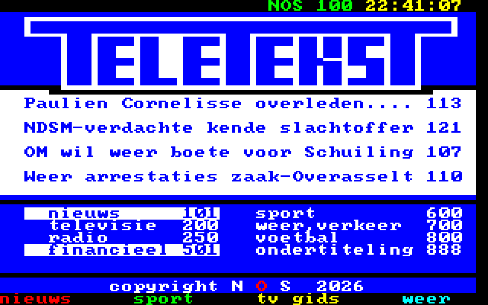

# Teletekst for the Apple IIgs

The IIgs version of the Mac's Teletekst app: NOS Teletekst from
`lftest serve` (which bridges to `ssh teletekst.nl`), over AppleTalk. It is
written in 65816 assembly, a GS/OS application of about 15 KB.



The IIgs has what the Mac Plus lacks: colour. The page fills the Super
Hi-Res screen in 320 mode, 40 × 25 cells of 8 × 8 pixels, in the eight
real Teletekst colours. The server's 26th row, the ssh service's status
line, is not shown: 25 rows of 8 lines fill the 200 lines exactly.

> **Status: starts, AppleTalk untested.** In GSplus (ROM 3, System 6.0.2)
> it starts, draws in Super Hi-Res, finds no AppleTalk and says so with a
> list of the GS/OS devices, and quits cleanly back to the Finder. No IIgs
> emulator speaks LToUDP (GSplus and GSport bridge AppleTalk to EtherTalk),
> so the network part waits for a real IIgs on a
> [picotalk](../../README.md) bridge. What could not be checked without
> hardware is listed under [Unverified](#unverified).
>
> In GSplus, AppleTalk and the emulated hard disk both need slot 7; boot
> from an 800K disk in slot 5 to try AppleTalk there.

## Building

```sh
./build.sh
```

This gives

* `build/Teletekst`: the application (file type S16, `$B3`), in OMF;
* `build/Teletekst.po`: an 800K ProDOS disk image holding it;
* `build/_Output.txt`: Merlin 32's listing, with every address and opcode.

The build needs two open-source tools by Brutal Deluxe: **Merlin 32** (a
65816 cross-assembler that writes GS/OS OMF files) and **Cadius** (ProDOS
disk images). `build.sh` uses them from the `PATH` (or `$MERLIN32` and
`$CADIUS`); if they are missing, it clones and compiles them into
`tools/bin`, which needs git, make and a C compiler. Any Linux, macOS or
WSL machine will do.

The font is generated and checked in; to regenerate it:

```sh
python3 tools/mkfont.py > src/font.s
```

## Running

1. Put `Teletekst.po` on the IIgs: on a floppy (ADTPro, or a Floppy Emu
   or BMOW's Wombat), a CFFA/BlueSCSI volume, or copied from an AppleShare
   server.
2. AppleTalk must be on. Install the network software with the System 6
   Installer (*Network: AppleShare*, or *AppleShare, 3.5" Disk* for a
   floppy). Then, in the Slots control panel (or the firmware Control
   Panel, Ctrl-⌘-Esc), set **Slot 7: AppleTalk**. It is greyed out until
   **Slot 1** (the printer port) is set to **Your Card**: AppleTalk takes
   over that port. Restart; the AppleTalk driver loads at boot.
3. Connect the printer port to LocalTalk, and from there to a picotalk
   bridge in `ltoudp` mode, on the same network as the PC running
   `lftest serve`.
4. Open **TELETEKST** from the Finder.

The app looks up `=:Teletekst@*` and shows page 100.

| Key | What it does |
|---|---|
| digits | go to a page |
| ← → | previous, next page |
| ↑ ↓ | up and down (subpages) |
| W A S D | the arrow keys, as on the Mac |
| ⌘1 – ⌘4, or `!` `@` `#` `$` | the red, green, yellow and blue keys |
| Return, Delete, other keys | go to the service as typed; `?` shows its help |
| Esc, ⌘Q | quit |

Quitting waits for requests still under way (the firmware would otherwise
write into memory the app has given back), at most about 12 seconds when
the server has gone.

## How it works

Everything is in [`src/teletekst.s`](src/teletekst.s); the protocol is the
Mac's, described in
[`server/lftest/src/teletekst.rs`](../server/lftest/src/teletekst.rs).

* **Screen.** The app writes to Super Hi-Res memory directly
  (`$E1/2000`, 160 bytes a line). It claims that memory with the Memory
  Manager, sets the scan-line control bytes to 320 mode and palette 0, and
  loads palette 0 with the Teletekst colours: index = the colour's bits
  (bit 0 red, bit 1 green, bit 2 blue), so an attribute's colour needs no
  translation. On quit it restores `NEWVIDEO` and the border colour.
* **Glyphs.** [`tools/mkfont.py`](tools/mkfont.py) turns Daniel Hepper's
  public-domain [font8x8](https://github.com/dhepper/font8x8) into masks:
  8 lines of 4 bytes, one nibble per pixel, `F` for ink and `0` for paper,
  for the 256 Mac Roman codes (the server sends Mac Roman) and the 64
  block-graphics patterns (in thirds of 3, 3 and 2 lines). A cell line is
  then two 16-bit operations, `paper EOR ((ink EOR paper) AND mask)`, with
  the colour in every nibble. The 16 stores a cell takes are unrolled, so
  a changed row (40 cells) draws in a few milliseconds.
* **AppleTalk.** The IIgs keeps AppleTalk in its firmware and the
  AppleTalk driver GS/OS loads. Programs call it with a parameter block:
  its address in X (low word) and Y (bank), then `JSL $E11014`
  (`RamDispatch`). The blocks have the same layout as the ProDOS 8
  AppleTalk calls (`$42`); the app uses two:

  | Call | Number | Used for |
  |---|---|---|
  | NBPLookup | `$10` | finding `=:Teletekst@*` |
  | SendATPReq | `$12` | POLL and KEY, exactly once (XO) |

  Both run asynchronously (async flag `$80`), so keys go out while a POLL
  is held at the server. A POLL allows 4 response packets into buffers
  that lie back to back, so the response arrives as one run of bytes.
* **Is AppleTalk there?** GS/OS lists the AppleTalk driver as a device
  with device ID `$1D` (Apple II AppleTalk Technical Note #1); the app
  walks the devices with `DInfo` before it makes any AppleTalk call.

### Sources

* The parameter blocks follow the NBPLookup and SendATPReq blocks in
  Michael Guidero's [NetBoot_LC](https://github.com/mgcaret/NetBoot_LC)
  (Apple //e Workstation Card boot blocks, ProDOS 8).
* The GS/OS entry, `RamDispatch` at `$E11014` with the block in X/Y,
  follows `callat.asm` in Stephen Heumann's
  [AFPBridge](https://github.com/sheumann/AFPBridge), which calls
  AppleTalk this way on real IIgs machines.
* The open [ORCA/C](https://github.com/byteworksinc/ORCA-C) sources do not
  include ORCA's `<AppleTalk.h>`, so the record layouts come from the two
  programs above; Apple's *AppleShare Programmer's Guide for the Apple
  IIGS* is the reference they follow.

## Unverified

Written from the sources above, not yet run on a IIgs:

* **Detecting completion.** Nothing at hand documents what the firmware
  writes into an asynchronous call's result while it runs (ASP uses
  `$07FF`). The app sets the result to `$FFFF`, makes the call, reads the
  result back, and treats the call as done when the result changes. That
  holds whatever the busy value is, unless it is `0`.
* **The ATP flags byte.** `$20` for exactly-once is the XO bit as in the
  ATP header and on the Mac; if the IIgs numbers its flags differently,
  requests go out at-least-once, which the server also handles.
* **Retry units.** Retry intervals are taken to be in quarter seconds, as
  NetBoot_LC's comments say.
* Claiming Super Hi-Res memory with `NewHandle` at `$E1/2000`: if it
  fails, the app draws anyway, as games do.
